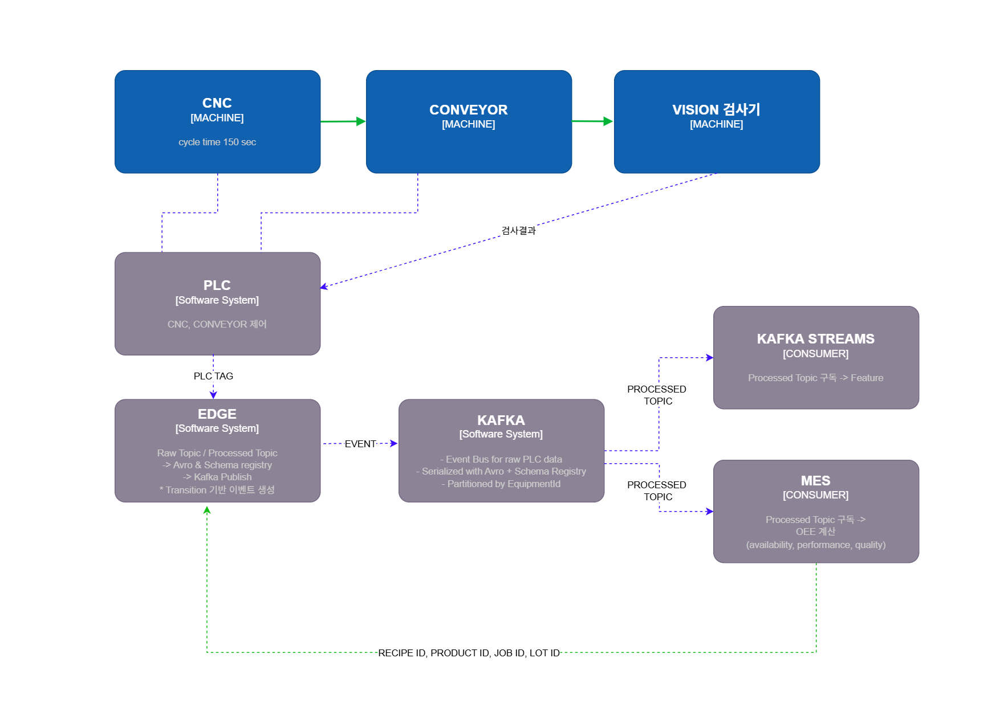

# AI 기반 제조 데이터 분석 및 OEE 개선 프로젝트

## 목차
- [프로젝트 개요](#프로젝트-개요)
- [시스템 구성](#시스템-구성)
- [주요 시나리오](#주요-시나리오)
- [데이터 및 분석](#데이터-및-분석)
- [AI/확장 가능성](#aI확장-가능성)
- [기술 스택](#기술-스택)
- [프로젝트 핵심 성과](#프로젝트-핵심-성과)

---

## 프로젝트 개요
- **목적**: 가상 공장을 기반으로 제조 데이터 수집 및 분석을 통해 OEE(Overall Equipment Effectiveness)를 개선하고, 이벤트 기반 이상 감지 및 AI 적용 가능성을 검증
- **주요 목표**:
  - CNC, 컨베이어, Vision 검사기 연계 생산 라인 시뮬레이션
  - 이벤트 기반 데이터 수집 및 Kafka 스트리밍 처리
  - 생산 및 품질 데이터를 활용한 OEE 산출
  - 이상 상황 시나리오 기반 성능 평가 및 AI 모델 설계 가능성 검증

---

## 시스템 구성
- **생산 라인**:
  - CNC 머신 (Cycle Time: 150초)
  - 컨베이어 + Vision 검사기 (가공 후 검사 포함 1분 30초)
  - PLC 1대가 CNC와 컨베이어 제어, Vision 검사 결과 수집
  - 제품 1개 가공 후 품질 검사 완료까지 **총 4분 소요**

- **데이터 흐름**:
  1. **PLC → Edge**: 표준 PLC Tag를 기반으로 Raw Event 생성 (`plc_raw_topic.avsc`)
  2. **Edge → Kafka Raw Topic**: EquipmentId를 Partition Key로 직렬화
  3. **Edge → Processed Topic**: MES에서 받은 ProductId, JobId, LotId 포함, 상태 변화 이벤트만 생성
  4. MES 및 Kafka Stream에서 구독:
     - MES → OEE 계산
     - Kafka Stream → Feature Topic 생성 (향후 AI 모델 활용)

- **전체 아키텍처 그림**
   

- **지원 문서/스키마**:
  - `plc_tag_definition.md` / `raw_topic_schema.md` / `processed_topic_schema.md` / `edge_transition_design.md`

---

## 주요 시나리오
1. **Tool Change – 즉시 대응**
   - CNC Tool Change Required 알람 발생 후 작업자가 즉시 대응
   - 알람 발생 시점부터 가공 중 제품은 **격리(Isolated Production)** 처리
   - 시험 가공 후 Vision 검사로 품질 확인, OEE 계산 완료

2. **Tool Change – 지연 대응**
   - 경고 알람 발생에도 CNC 가공 지속 → 작업자 늦게 대응
   - Reject 급증 → 생산 성능 저하 확인
   - AI 필요성 강조 (알람 지연 대응으로 성능 차이 발생)

3. **Line Jam**
   - 컨베이어 micro stop 반복 → Jam 발생 → CNC도 멈춤
   - 다운타임 증가 → 가동률 감소
   - 이벤트 기반 AI 설계 가능성: 최근 5개 제품 처리 간격 증가 시 Jam 위험 경고

---

## 데이터 및 분석
- PLC Event → Edge 처리 → Kafka Topic → MES / Stream 처리
- 이벤트 기반 OEE 계산:
  - Availability, Production Count, Isolation Count, Good/Reject 비율
- 다운타임 원인 분석: AlarmCode 매핑, 기준 Cycle Time 마스터 테이블 활용

---

## AI/확장 가능성
- 현재 AI 모델은 미구현
- 설계 아이디어:
  - 규칙 기반 + 통계 기반 생산 이상 감지
  - 이벤트 데이터만으로 Jam 위험, Reject 급증 등 예측
- Feature Topic 확장 가능성으로 향후 **AI 기반 제조 최적화** 검증 가능

---

## 기술 스택
- **PLC / Edge Computing**: 실시간 생산 데이터 수집 및 처리
- **Kafka / Avro / Schema Registry**: 이벤트 스트리밍, 데이터 직렬화, Partition Key: EquipmentId
- **MES**: 생산 관리, OEE 계산
- **데이터 분석**: Python, Pandas, 통계 기반 시뮬레이션
- **문서화**: Markdown 기반 Tag 정의 및 Topic Schema

---

## 프로젝트 핵심 성과
- 시뮬레이션 기반 OEE 계산 자동화
- 이벤트 기반 품질/생산 모니터링 시스템 설계
- 이상 상황 대응 시나리오별 성능 비교 → AI 적용 필요성 도출
- 확장 가능한 Kafka 기반 이벤트 처리 구조 설계