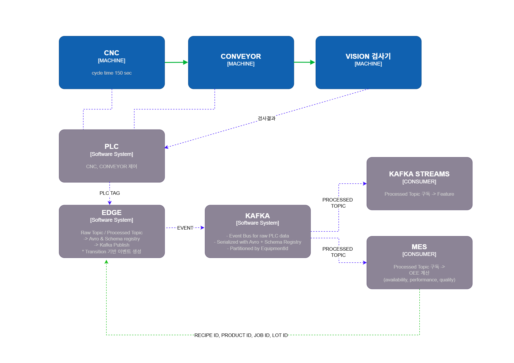

# Event-Driven Anomaly Detection for Smart Manufacturing

Detect anomalies before production loss.

---

## Overview

This project simulates a smart factory production line and demonstrates how **event-driven manufacturing data** can be used to:

- reconstruct production behavior
- compute OEE (Overall Equipment Effectiveness)
- detect anomalies **before quality degradation becomes visible**

> Production loss is not caused by anomalies themselves,  
> but by **when they are detected and handled**.

---

## System Architecture



- PLC → Edge → Kafka → MES / Stream Processing  
- Raw → Processed → Feature Topic pipeline  
- Feature-based architecture for anomaly detection and AI extension  

---

## Key Concepts

### 1. State Reconstruction

PLC generates discrete events.  
We reconstruct continuous system states from these events.

👉 [State Timeline](https://99Mia.github.io/smart-factory-oee-platform/state_timeline_s02.html)

```python
df["state"] = df["state"].ffill()
df["interval"] = df["timestamp"].diff()
```

---

### 2. Flow-Based System Behavior

Anomalies propagate across the production line.

👉 [CNC Timeline](https://99Mia.github.io/smart-factory-oee-platform/cnc_line_jam_timeline_03.html)  
👉 [Conveyor Timeline](https://99Mia.github.io/smart-factory-oee-platform/conveyor_line_jam_03_timeline.html)

---

### 3. Early Signal Detection

Early anomaly signals appear before visible quality degradation.

👉 [Anomaly Signals](https://99Mia.github.io/smart-factory-oee-platform/tooldelay_s02_timeline.html)

```python
df["interval_std"] = df["interval"].rolling(5).std()
df["reject_streak"] = (df["reject"] == 1).groupby((df["reject"] != 1).cumsum()).cumsum()
```

---

### 4. Hybrid Detection Logic

Rule-based + Statistical detection combined.

👉 [Detection Logic](https://99Mia.github.io/smart-factory-oee-platform/toolchange_s01_timeline.html)

```python
z = (x - x.mean()) / x.std()
alert = (reject_streak >= 2) or (abs(z) > 2)
```

---

## Scenarios

### Tool Change (Immediate vs Delayed)
- Immediate response prevents quality loss  
- Delayed response increases reject rate  

### Line Jam
- Conveyor issues propagate upstream  
- Entire production line affected  

---

## Data Pipeline & Processing

- PLC → Edge: Raw event generation  
- Edge → Kafka: Raw Topic (EquipmentId partitioning)  
- Kafka → Processed Topic: State change events  
- Kafka Stream → Feature Topic: Feature generation for AI  

---

## OEE & Analysis

- Availability, Production Count, Reject Ratio  
- Downtime analysis using AlarmCode mapping  
- Cycle time baseline comparison  

---

## Core Implementation

### Event → State Reconstruction
```python
df["state"] = df["state"].ffill()
df["duration"] = df["timestamp"].diff()
```

### Feature Engineering
```python
df["interval"] = df["timestamp"].diff()
df["reject_rate"] = df["reject"].rolling(5).mean()
df["alarm_count"] = df["alarm"].rolling(5).sum()
```

### Hybrid Detection
```python
rule = (reject_streak >= 2)
stat = abs(z_score) > 2
alert = rule or stat
```

---

## Design Decisions

- Event-driven architecture for manufacturing data  
- Feature-based anomaly detection approach  
- Hybrid detection (rule + statistical) for robustness  

---

## Tech Stack

- Kafka / Avro / Schema Registry  
- Python / Pandas  
- Kafka Streams  
- PLC / Edge / MES  
- Plotly (Interactive Visualization)  

---

## Project Highlights

- Event-driven smart factory simulation  
- OEE calculation and production analysis  
- Hybrid anomaly detection system  
- AI-ready feature pipeline  

---

## Detailed Documentation

For full system design and schema definitions:

- docs/plc_tag_definition.md  
- docs/raw_topic_schema.md  
- docs/processed_topic_schema.md  
- docs/feature_topic_schema.md  
- docs/edge_transition_design.md  
- docs/feature_generation_logic.md  
